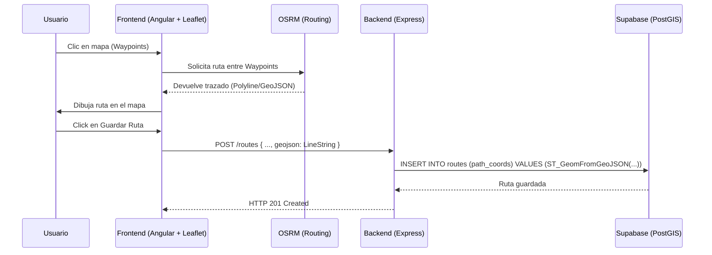

## Context

El sistema cuenta actualmente con un diseño base en Figma que rige la interfaz y la Experiencia de Usuario de las secciones de Rutas y Eventos. A nivel técnico, la base de datos ya cuenta con PostGIS habilitado y unas tablas iniciales (`routes` y `events`) con campos geométricos. Sin embargo, carecemos de la implementación frontend para trazar rutas geolocalizadas reales o marcar puntos de eventos, y la base de datos debe actualizarse para soportar los nuevos campos recogidos en el prototipo visual (dificultad, categoría de vehículo, límite de asistentes).

## Goals / Non-Goals

**Goals:**

- Proporcionar una interfaz basada en Leaflet para que los usuarios puedan crear **rutas en carretera** haciendo clics en puntos clave, apoyándose en una librería de enrutamiento (ej. Leaflet Routing Machine o similar) para generar el `LineString` GeoJSON final.
- Proporcionar un mapa interactivo para fijar ubicaciones **estáticas** de los eventos.
- Asegurar que la persistencia en Supabase (tabla `routes` y `events`) es compatible con PostGIS.
- Actualizar el esquema de la BD (`schema.sql`) para alinearlo 1:1 con Figma.

**Non-Goals:**

- Trazado de rutas Off-Road (fuera de carretera o dibujado libre manual sin snap a carreteras).
- Integración de sistemas de mapas de pago (Google Maps API, Mapbox) para evitar costes recurrentes.

## Decisions

1. **Leaflet como Motor de Mapas**: Se utilizará `leaflet` (junto a `@types/leaflet`) debido a que es open-source, gratuito y no necesita API Keys complejas. El mapa base puede servirse desde OpenStreetMap.
2. **Cálculo Dinámico de Rutas**: En lugar de requerir que el usuario suba un GPX, el usuario fijará puntos (waypoints) en el frontend. Usaremos un servicio de _routing_ (como el open-source OSRM a través de `leaflet-routing-machine` o calculándolo manualmente si se usa un wrapper) para trazar la línea entre puntos por la carretera.
3. **Modificación de Base de Datos**:
   - `public.routes`: Añadiremos los campos `vehicle_category` (ENUM o TEXT: 'car', 'motorcycle', 'both') y `difficulty` (ENUM o TEXT: 'low', 'medium', 'high').
   - `public.events`: Añadiremos el campo `max_attendees` (INT). Confirmamos que la ubicación sigue siendo un `Point`.

## Risks / Trade-offs

- **Dependencia de OSRM gratuito**: El servidor público de OSRM (usado por defecto en algunas librerías) no garantiza SLAs de producción para apps con alto tráfico. A corto plazo servirá para el MVP, pero en el futuro podría requerirse alojar una instancia propia de OSRM o usar una API con capa gratuita como Mapbox/OpenRouteService si el uso es abusivo.
- **Precisión Móvil**: En el frontend, trazar rutas haciendo clics precisos en pantallas móviles pequeñas puede ser un reto de UX, por lo que el diseño debe asegurar botones claros de "Deshacer último punto" o "Limpiar ruta".
